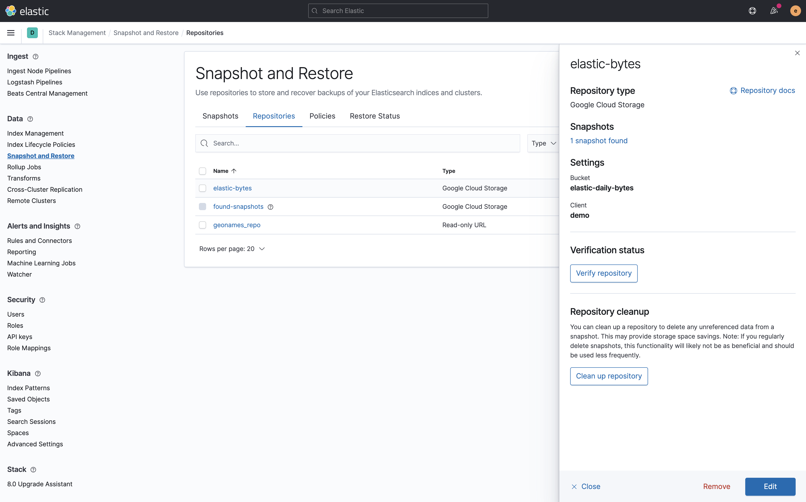
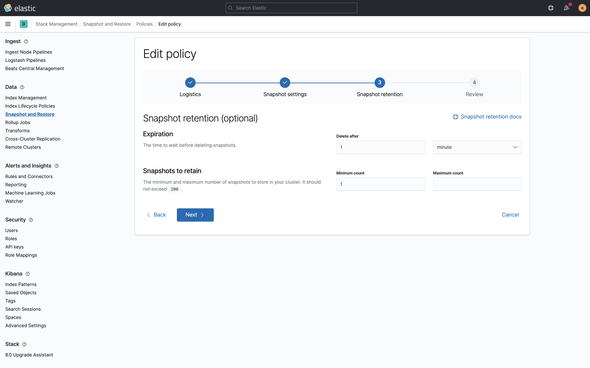

# Demo scripts used for Elastic Daily Bytes - Snapshots Management


## Setup

You first need to [create a Google Cloud Storage bucket](https://www.elastic.co/guide/en/elasticsearch/plugins/current/repository-gcs-usage.html#repository-gcs-creating-bucket) to hold the snapshots. It must be named `elastic-daily-bytes`.
Then [create a service account](https://www.elastic.co/guide/en/elasticsearch/plugins/current/repository-gcs-usage.html#repository-gcs-using-service-account) and download the json service file to `elasticsearch-config/service-account.json`.

The setup will check that Elasticsearch and Kibana are running.

It will also add Kibana Canvas slides.

It will remove:

* index `demo-person`
* repository `elastic-bytes`
* `daily-bytes` snapshot policy

### Run on cloud (recommended)

Open your cloud deployment in the [cloud console](https://cloud.elastic.co/deployments) and 
open the security tab. Click on `Add settings` near the "Elasticsearch keystore".

Add the setting `gcs.client.demo.credentials_file` as a "JSON/Block file" and copy/paste the content of 
`elasticsearch-config/service-account.json` in it. Then click "Save".

This specific configuration is used to run the demo on a [cloud instance](https://cloud.elastic.co).
You need to create a `.cloud` local file which contains:

```
CLOUD_ID=the_cloud_id_you_can_read_from_cloud_console
CLOUD_PASSWORD=the_generated_elastic_password
```

Run:

```sh
./setup.sh
```

### Run Locally (NOT SUPPORTED FOR THIS DEMO)

Run Elastic Stack:

```sh
docker-compose down -v
docker-compose up --build
```

And run:

```sh
./setup.sh
```

## Demo part

### Create a repository

Open the "Stack Management" menu, choose "Snapshot and Restore" and register a new repository.


We already [created a google cloud client](https://www.elastic.co/guide/en/elasticsearch/plugins/current/repository-gcs-client.html) in `elasticsearch.yml` so we can use it here.
The bucket we are using for the demo is `elastic-daily-bytes`.


Once the repository is added, you can have an overview of it. There is one snapshot available.



### Restore a snapshot

You can click on the "1 snapshot" link or open the Snapshots tab and click on the `demo-backup` snapshot to have access to its details. It was created in March for [Elastic Daily Bytes season 01 - Searchable Snapshots](https://github.com/dadoonet/demo-searchable-snapshots).


We can click on Restore and select what we want to restore exactly.


We can also change some index settings.


Click on "Restore snapshot" to launch the restore operation.


The restore is starting and you can follow its progress with nice details.


### Snapshot policies

As this will take a significant amount of time, we can look at policies in the meantime. Open the "Policies" tab. There's a default one here as we are running on cloud, there are automatic backups made for you every 30 minutes.


Click on Create policy to create a new one named `daily-bytes`. As it's a demo, we want to run many snapshots in the next minutes, so we are choosing a timebased snapshot name pattern: `<demo-{now{HH.mm.ss}}>`.
We will be using the `elastic-bytes` repository we created early on. The minimum schedule we can have is every 15 minutes so we are using `0 */15 * * * ?` cron expression.


We want to only backup the `demo-person` index.


And we want it to expire after one minute and only keep always one snapshot. That's for demo purpose of course. You probably want to have more like 7 days of backups for this policy.



Just review and click on "Create policy" to confirm.


We can manually run the policy by clicking on the "Run now" button. And for the demo, we can do that multiple times.


We can see that our snapshot has been made.


We can manually run the retention job by clicking on the "Run retention now" button. It will remove the snapshots which are not needed anymore.


### Delete snapshots

We can also manually remove snapshots we don't need anymore.


### Remove a repository

And we can also remove the repository.


Note that it won't remove the remaining snapshots and their data but just the link to the Google Cloud Storage bucket.


